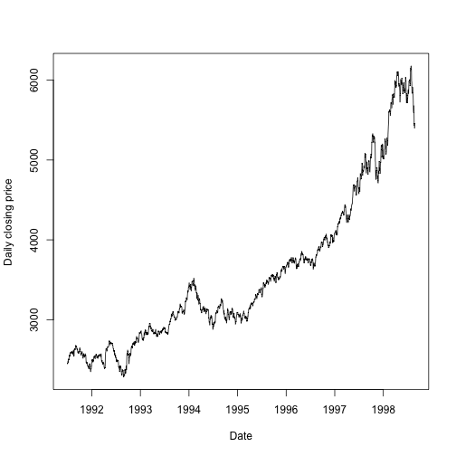

## Introduction

This slidify presentation describes the shiny application I have created for the Coursera Course 'Developing Data Products'.

It uses the EuStockMarket dataset in R, kindly provided by Erste Bank AG, Vienna, Austria. 


---  
## Background

The value of the stock market is of great interest to many businesses and financiers. However, with so much data available on the values of stockmarkets it can be difficult to find out how these markets have changed in value over the years.

This shiny app aims to assist with this.


---
## Input

This shiny app uses the EuStockMarkets dataset contained within the datasets package in R. 

First, the user selects a market from the dropdown menu. The options are "DAX", "SMI", "CAC" and "FTSE".


---
## Output 1

The value of the market over time is then plotted on the right of the screen. Let's assume "FTSE" was chosen.

 

---
## Output 2

Underneath the plot, a summary of the minimum, maximum, median  and 1st and 3rd quartiles of the value of this market are shown.


```r
library(datasets)
index="FTSE"
dataset <- EuStockMarkets[,index]
summary(dataset)
```

```
##    Min. 1st Qu.  Median    Mean 3rd Qu.    Max. 
##    2281    2843    3247    3566    3994    6179
```


